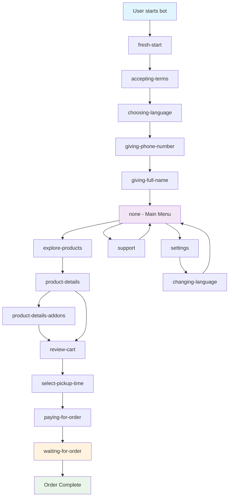

# Dringo Lite - Customer Flow Diagram
## Visual Representation of Bot Conversation States

### Complete Customer Journey Flow



### State Details

#### Registration Flow (Linear)
```
fresh-start
├── Shows welcome message
├── Prompts to accept terms
└── Transitions to: accepting-terms

accepting-terms
├── Shows terms and conditions
├── "I Agree" button only
└── Transitions to: choosing-language

choosing-language
├── Language selection keyboard
├── Options: 🇷🇺 Русский, 🇺🇿 O'zbek tili, 🇺🇸 English
└── Transitions to: giving-phone-number

giving-phone-number
├── Contact sharing prompt
├── Phone number validation
└── Transitions to: giving-full-name

giving-full-name
├── Full name input prompt
├── Text validation
└── Transitions to: none (Main Menu)
```

#### Main Menu (none state)
```
Main Menu Options:
├── ☕️ Explore Products → explore-products
├── 📞 Support → support
└── ⚙️ Settings → settings
```

#### Shopping Flow
```
explore-products
├── Product list with cart indicators
├── Numbered products with ✅ for in-cart items
├── Back and Cart buttons
└── Product selection → product-details

product-details
├── Product info and description
├── Size selection (Small/Medium/Large)
├── Quantity controls (➖/➕)
├── Edit Details button (if quantity > 1)
└── Next button → review-cart

product-details-addons
├── Item selection (1, 2, 3...)
├── Add-on categories (Sugar, Syrup, Cream)
├── Per-item customization
├── Back and Next buttons
└── Returns to: product-details

review-cart
├── Cart items list with prices
├── Remove individual items (❌ Remove 1, 2, 3...)
├── Remove all items option
├── Back and Select Time buttons
└── Select Time → select-pickup-time

select-pickup-time
├── Time slots (15-minute intervals)
├── 10 time options from +15 minutes
├── Back button
└── Time selection → paying-for-order

paying-for-order
├── Order summary with pickup time
├── Payment details (card number)
├── Screenshot requirement warning
├── Pay button
└── Payment confirmation → waiting-for-order

waiting-for-order
├── Order confirmation with ID
├── Payment screenshot reminder
├── Pickup instructions
├── "✅ I've picked up my order" button
└── Order completion
```

#### Utility States
```
support
├── Contact information
├── Back button
└── Returns to: none

settings
├── Change Language option
├── Back button
└── Returns to: none

changing-language
├── Language selection
├── Back button
└── Returns to: settings
```

### State Transitions

#### Forward Transitions (Registration)
- `fresh-start` → `accepting-terms`
- `accepting-terms` → `choosing-language`
- `choosing-language` → `giving-phone-number`
- `giving-phone-number` → `giving-full-name`
- `giving-full-name` → `none`

#### Navigation Transitions
- `none` ↔ `explore-products`
- `none` ↔ `support`
- `none` ↔ `settings`
- `settings` ↔ `changing-language`

#### Shopping Transitions
- `explore-products` → `product-details`
- `product-details` ↔ `product-details-addons` (if quantity > 1)
- `product-details` → `review-cart`
- `review-cart` → `select-pickup-time`
- `select-pickup-time` → `paying-for-order`
- `paying-for-order` → `waiting-for-order`

### Key Features by State

#### Cart Management
- **explore-products**: Shows ✅ indicators for in-cart items
- **product-details**: Quantity controls and size selection
- **product-details-addons**: Per-item add-on customization
- **review-cart**: Remove items, view total, proceed to checkout

#### Add-ons System
- **Sugar**: 0, 1, 2, 3 spoons (free)
- **Syrups**: Vanilla, Caramel, Hazelnut (+3000 UZS)
- **Cream**: Whole milk, Almond milk, Oat milk (varying prices)

#### Multi-language Support
- **choosing-language**: Initial language selection
- **changing-language**: Language change in settings
- All states support dynamic localization

#### Order Processing
- **select-pickup-time**: 15-minute interval time slots
- **paying-for-order**: Payment instructions and screenshot requirement
- **waiting-for-order**: Order confirmation and pickup instructions

### Error Handling
- Stale update filtering (ignores pre-startup messages)
- Input validation at each state
- Graceful error messages with retry options
- State persistence across sessions

### Data Flow
```
User Input → Validation → Action → State Update → Response → Database Save
```

This flow ensures a smooth, intuitive user experience while maintaining data integrity and providing comprehensive error handling.
